<div align="center">

# BusBench

**Ten automotive and avionics protocols, implemented twice (in C and in Python), tested against each other, and explorable in one desktop workbench.**

CAN · UDS / ISO-TP · AUTOSAR · ISO 26262 · DoIP · ARINC 429 · MIL-STD-1553 · ARINC 653 · DO-178C · Flight data recorder

[](https://github.com/Alifizz01/BusBench/actions/workflows/ci.yml)


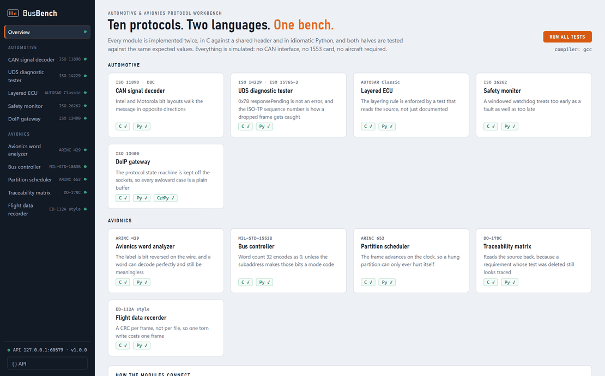

</div>

---

## The problem

Vehicles and aircraft run on a handful of buses and standards. Learning them, prototyping
against them and proving that an implementation is right are all harder than they should be:

| # | Problem | What it costs | How BusBench answers it |
|---|---|---|---|
| 1 | **The knowledge is locked behind hardware and licences.** Seeing a CAN signal, a 1553 transaction or a DoIP session usually means a bus interface plus CANoe, a DDC/Astronics card or a vendor analyzer. | Thousands of euros before the first frame; students and small teams learn from PDFs instead of traffic. | Every bus is **simulated**. Clone, install, and all ten protocols run on a laptop with the standard library only. |
| 2 | **Prototype in Python, ship in C, and the two drift apart.** | A decoder that is right in the notebook and wrong on the ECU, found late. | Each module exists **twice**, the C half against a shared header contract. Both halves pin the **same expected values**, and the Python DoIP tester drives the **C gateway over real TCP** in every test run. |
| 3 | **Bus parsers are attack surface.** DoIP listens on TCP 13400; ISO-TP reassembly and CAN bit-walking index into buffers with lengths taken off the wire. | Out-of-bounds reads and crashes on the first malformed frame, or a car that answers UDS to anyone. | **libFuzzer** on four C parsers, **ASan + UBSan** builds of every C test, **cppcheck**, and **property tests** that compare decoders against independent reference formulas over thousands of random inputs. |
| 4 | **Certification wants traceability, and spreadsheets rot.** DO-178C and ISO 26262 expect every requirement to trace to a passing test, and every test to a requirement. | A requirement whose test was deleted still looks traced; audits find it, not CI. | A traceability tool that reads requirements, JUnit results **and the source tree back**, and **BusBench uses it on itself**: 36 requirements ↔ 71 tests, enforced as a CI gate. |
| 5 | **Protocols are invisible.** Endianness, bit-reversed labels, sequence numbers and time slices only exist as tables in a standard. | The classic mistakes (Motorola bit order, treating 0x78 as an error, a stale signal read as current) get made in production code. | **BusBench Studio** shows the bits: every frame, word and header drawn as a field-by-field ribbon, live, for every module. |
| 6 | **Every bus comes with its own tool.** | Ten tools, ten data formats, no automation across them. | One package, **one CLI, one REST API, one GUI**. The modules are wired together too: DoIP → ISO-TP → UDS ECU, and CAN + ARINC 429 traffic → flight data recorder. |

**Who it is for:** automotive and avionics software and test engineers, embedded developers
learning these buses, and students who want to see real protocol behaviour without lab
hardware.

**What it is not:** a certified tool or a hardware driver. The protocols are faithful in the
parts that matter (framing, state machines, failure handling) and each module README ends with
a **Simplifications** section that says exactly what was left out.

---

## BusBench Studio

One native desktop window for all ten modules (`busbench studio`). The signature is the **bit ribbon**:
the same field colours on every protocol: blue for identifiers and labels, teal for data, violet for
control, amber for status, rose for checksums.

| | |
|---|---|
| 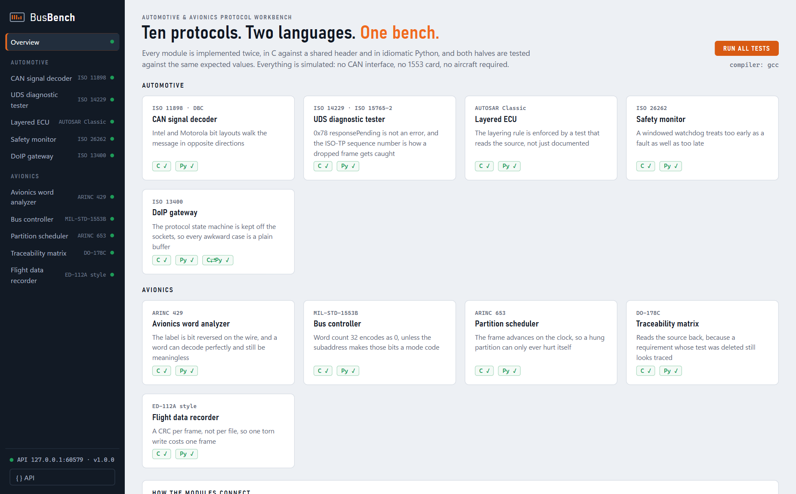 | 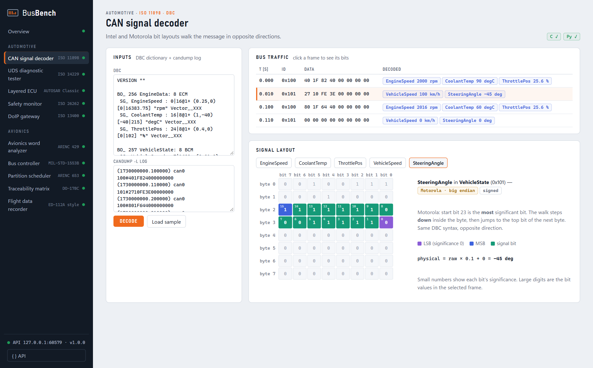 |
| **Overview.** Run every C and Python suite plus the C⇄Python interop check from the GUI. | **CAN.** Pick a signal and see exactly which bits it occupies, in significance order. Intel climbs, Motorola walks down and jumps bytes. |
| 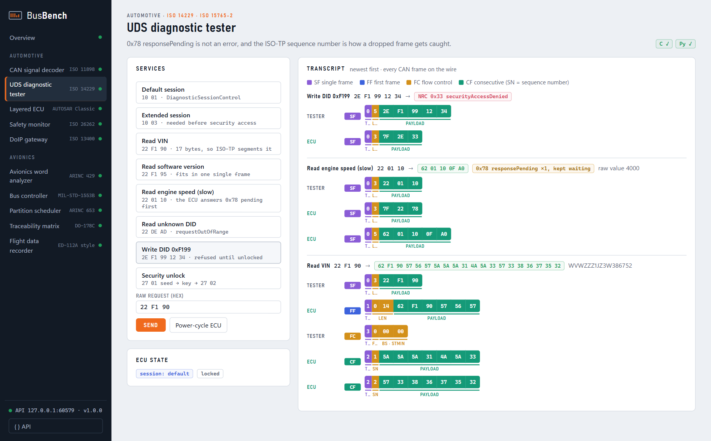 | 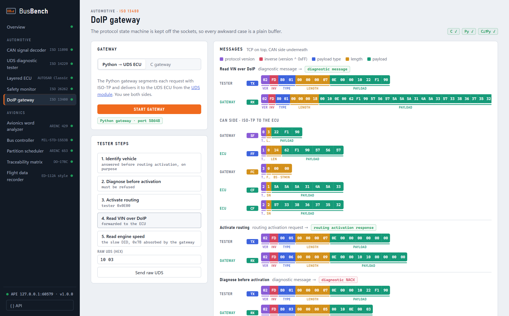 |
| **UDS.** Every request, response and negative response code, with each ISO-TP frame (SF / FF / FC / CF) on the wire. | **DoIP.** Header ribbons for TCP, and underneath the ISO-TP frames the gateway really puts on the CAN side. Runs against the Python **or the C** gateway. |
| 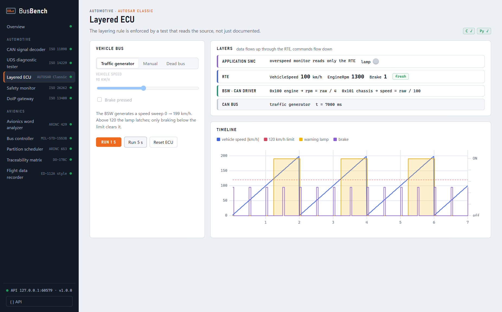 | 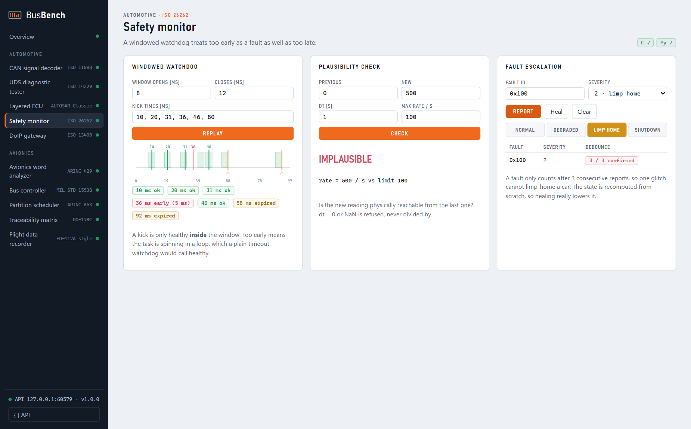 |
| **AUTOSAR.** SWC / RTE / BSW layers with live values. Kill the bus and watch the lamp fail visible when the signal goes stale. | **ISO 26262.** Windowed watchdog timeline, plausibility check, and debounced fault escalation to limp-home. |
| 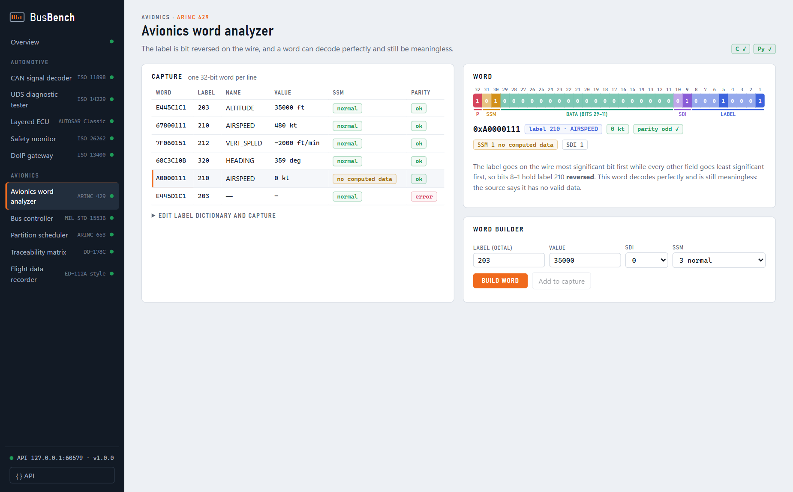 | 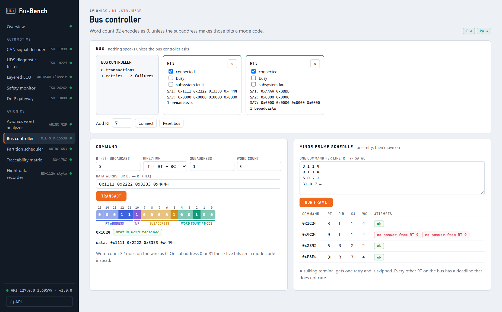 |
| **ARINC 429.** All 32 bits by field; a word can decode perfectly and still be unusable (SSM). Build your own words. | **MIL-STD-1553.** Toggle terminals busy / faulty / disconnected and run a minor frame with retries. |
| 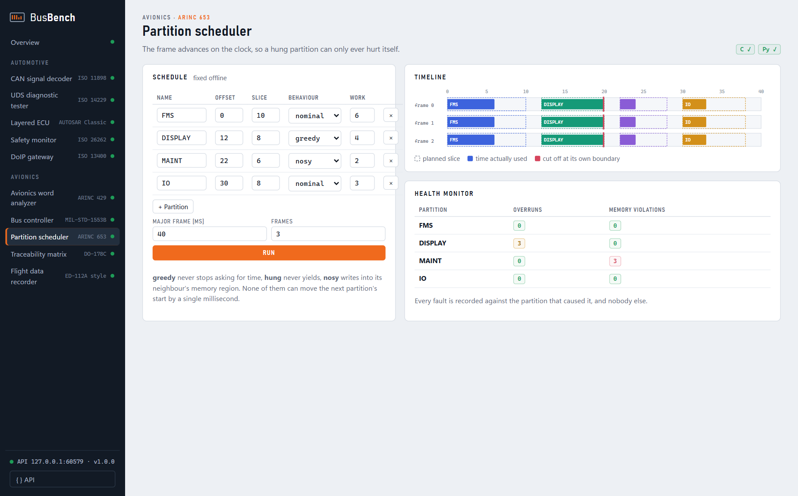 | 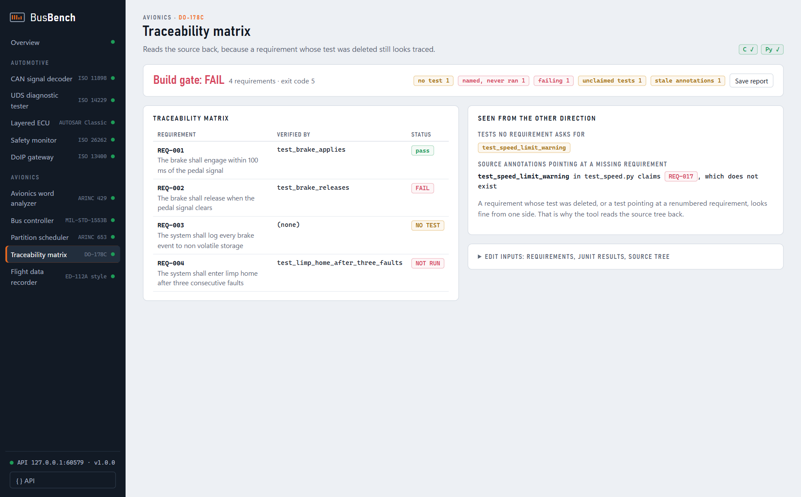 |
| **ARINC 653.** Greedy, hung and nosy partitions are cut off at their own boundary; nobody else moves. | **DO-178C.** Requirements × JUnit results × source annotations, with the gaps you only see from the other direction. |
| 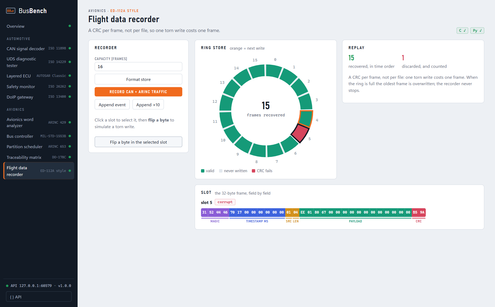 | |
| **FDR.** Record the CAN and ARINC traffic, flip a byte, and lose exactly one frame. | |

Every button is a call to the local REST API, and the **{ } API** button shows it as a ready-to-copy `curl` command.

---

## The modules

| Domain | Module | Standard | The one thing worth reading it for |
|---|---|---|---|
| Automotive | [`can`](busbench/can) | ISO 11898 · DBC | Intel and Motorola bit layouts walk the message in opposite directions |
| Automotive | [`uds`](busbench/uds) | ISO 14229 · ISO 15765-2 | `0x78` responsePending is not an error, and the ISO-TP sequence number is how a dropped frame gets caught |
| Automotive | [`autosar`](busbench/autosar) | AUTOSAR Classic | The layering rule is enforced by a test that reads the source, not just documented |
| Automotive | [`safety`](busbench/safety) | ISO 26262 | A windowed watchdog treats too early as a fault as well as too late |
| Automotive | [`doip`](busbench/doip) | ISO 13400 | The protocol state machine is kept off the sockets, so every awkward case is a plain buffer |
| Avionics | [`arinc429`](busbench/arinc429) | ARINC 429 | The label is bit reversed on the wire, and a word can decode perfectly and still be meaningless |
| Avionics | [`mil1553`](busbench/mil1553) | MIL-STD-1553B | Word count 32 encodes as 0, unless the subaddress makes those bits a mode code |
| Avionics | [`arinc653`](busbench/arinc653) | ARINC 653 | The frame advances on the clock, so a hung partition can only ever hurt itself |
| Avionics | [`traceability`](busbench/traceability) | DO-178C | Reads the source back, because a requirement whose test was deleted still looks traced |
| Avionics | [`fdr`](busbench/fdr) | ED-112A style | A CRC per frame, not per file, so one torn write costs one frame |

Each module folder holds both halves and everything they share:

```
busbench/<module>/
  include/    the C header: the interface contract both versions follow
  src/        C implementation
  *.py        Python implementation (an importable subpackage)
  test/       test_x.c and test_x.py, pinned to the same expected values
  data/       sample DBC files, logs, captures and requirements where needed
  README.md   what it does, the design decision behind it, and the simplifications
```

### How the modules connect

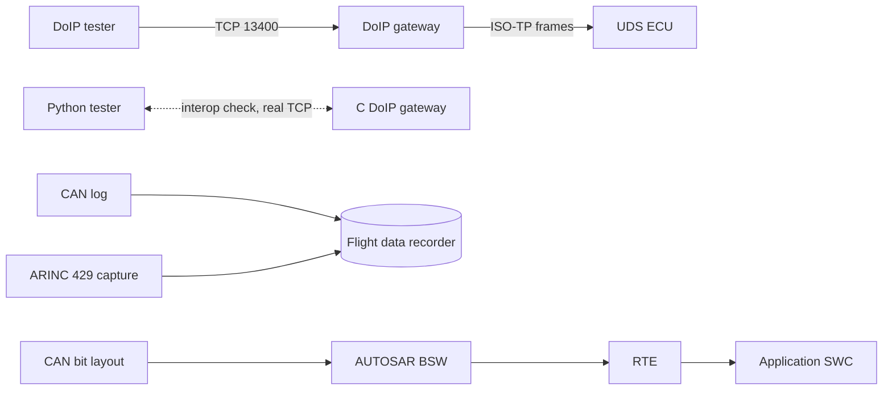

---

## Engineering evidence

| Practice | Where | What it proves |
|---|---|---|
| **Twin implementations** | every module: ~3,000 lines of C11, ~2,200 lines of Python | Both halves pin the same expected values (e.g. the ARINC 429 capture, the CRC-16 check value, the traceability verdict), so they cannot drift without a test going red |
| **Cross-language interop** | `busbench test doip` | The Python tester drives the compiled C gateway over real TCP: identify, refused diagnostics, routing activation, VIN |
| **Compiler matrix** | CI: gcc + clang (Linux), MSVC (Windows) | Portable C11, warnings on (`-Wall -Wextra`, `/W3`) |
| **Sanitizers** | `busbench test --sanitize` | Every C test suite clean under AddressSanitizer + UndefinedBehaviorSanitizer |
| **Fuzzing** | [`fuzz/`](fuzz) | libFuzzer + ASan + UBSan on CAN decode, ISO-TP reassembly, DoIP message handling and ARINC 429 analysis |
| **Static analysis** | CI: cppcheck | warning, portability and performance checks over all C sources |
| **Property tests** | [`tests/test_robustness.py`](tests/test_robustness.py) | CAN decoding vs an independent textbook formula on 3,000 random signal geometries; all 65,536 MIL-1553 command words round-trip; any single bit flip in an FDR frame is rejected |
| **Self-traceability** | [`requirements/`](requirements/busbench_requirements.csv) + CI | BusBench's own DO-178C tool gates the build: 36 requirements, 71 tests, zero gaps. The matrix is published in every CI run |

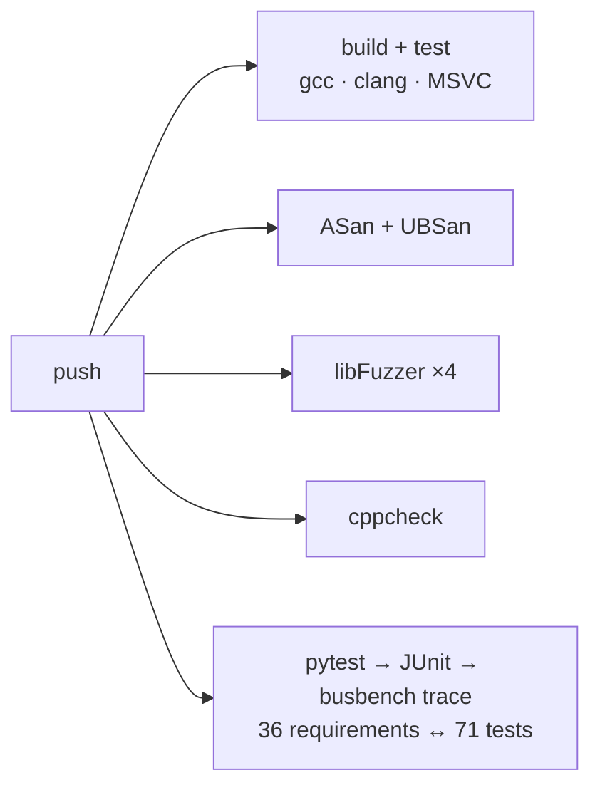

---

## Quick start

```bash
git clone https://github.com/Alifizz01/BusBench && cd BusBench
pip install -e ".[studio]"        # standard library only, plus pywebview for the desktop window

busbench studio                   # the desktop workbench
busbench test                     # every C and Python suite + interop (finds gcc, clang or MSVC itself)
busbench test --py                # Python only, no compiler needed
busbench demo arinc429            # any module's command-line demo
```

The runner finds a compiler on its own: gcc / clang on PATH, an MSYS2 gcc that is not on PATH,
or Visual Studio's MSVC through `vswhere`. With no compiler it runs the Python half and says
so, rather than quietly passing.

### Use it from code

```python
from busbench.uds import UdsClient, EcuSim
from busbench.arinc429 import build_word, analyze, Label

ecu = EcuSim()
client = UdsClient(ecu.client_send, ecu.client_recv)
print(client.read_data_by_identifier(0xF190).decode())     # VIN, reassembled by ISO-TP

word = build_word(0o203, 0, 35000, 3, 18)                  # altitude, SSM normal
print(hex(word), analyze(word, {0o203: Label(0o203, "ALTITUDE", "ft", 1.0, 18)}))
```

### Or over the REST API

`busbench serve` (or an open Studio) answers on `http://127.0.0.1:8770`. Every function in
[`busbench/api.py`](busbench/api.py) is `POST /api/<name>`:

```bash
curl -X POST http://127.0.0.1:8770/api/uds_request -H "Content-Type: application/json" \
     -d '{"request": "22 F1 90"}'
# → {"ok": true, "response": "62 F1 90 57 56 ...", "note": "WVWZZZ1JZ3W386752",
#    "frames": [{"from": "tester", "kind": "SF", ...}, {"from": "ecu", "kind": "FF", ...}, ...]}
```

| Group | Endpoints |
|---|---|
| Overview | `modules`, `test_start`, `test_status` |
| CAN | `can_sample`, `can_decode` |
| UDS | `uds_reset`, `uds_request` |
| AUTOSAR | `autosar_reset`, `autosar_run` |
| ISO 26262 | `safety_watchdog`, `safety_plausibility`, `safety_faults` |
| DoIP | `doip_start` (Python or C gateway), `doip_send`, `doip_stop` |
| ARINC 429 | `arinc429_sample`, `arinc429_analyze`, `arinc429_build` |
| MIL-STD-1553 | `mil1553_state`, `mil1553_rt`, `mil1553_transact`, `mil1553_schedule`, `mil1553_reset` |
| ARINC 653 | `arinc653_run` |
| DO-178C | `traceability_sample`, `traceability_analyze` |
| FDR | `fdr_reset`, `fdr_state`, `fdr_append`, `fdr_record_buses`, `fdr_corrupt` |

The server binds to 127.0.0.1 only and requires JSON bodies with a localhost `Host` header, so a
web page you visit cannot drive the bench.

### Trace your own project

```bash
pytest --junitxml=junit.xml
busbench trace --requirements reqs.csv --results junit.xml --source src/ tests/ --out report.md
# exit code = number of problems: untested requirements, tests that never ran, failing tests,
# tests no requirement asks for, and @req annotations pointing at requirements that do not exist
```

---

## Why both languages

They are not translations of each other. Each half is written the way that language is
actually written, and the differences are called out in the module READMEs. The clearest
example is error reporting: the C clients return a result code you have to check, while the
Python ones raise, so a caller cannot use a buffer after a failure by forgetting to look at a
return value.

## Layout

```
busbench/            the package: ten modules, runner, REST API, Studio
  <module>/          C + Python + tests + data for one protocol (see above)
  runner.py          builds and runs both halves, finds gcc / clang / MSVC
  api.py server.py   REST API
  studio/            the desktop GUI (HTML/CSS/JS, uPlot), opened by studio_app.py
tests/               cross-module, interop, API and property tests
fuzz/                libFuzzer harnesses for the C parsers
requirements/        BusBench's own requirements, traced in CI
assets/              README images; make_screenshots.py regenerates all of them
```

## Notes

* C11 and Python 3.10+, standard library only at runtime. Studio adds `pywebview`.
* Some C headers gained declarations the original contracts did not have. Each addition is
  marked `added:` in the header with the reason; the original declarations are untouched.
* Every module README ends with a **Simplifications** section. They are choices, not oversights.

## License

MIT · © Muhamad Alif Izzuwan Bin Ibrahim ([github.com/Alifizz01](https://github.com/Alifizz01))
